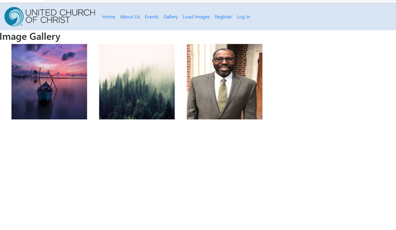

# Saint Mark UCC Home Page

## Summary
This is a the web page for church looking to enhance it's internet presence. It contains content describing the church's values, history, staff, images of past events, and a schedule of upcoming events.

#### Home Page

#### Event Schedule

#### Image Gallery

## Components and Dependencies

The site's file structure was created with Express-Generator.  Express-Generator comes with Pug, which is used as the view-engine to serve HTML.

The backend has a mongo database to house the collections storing events, image URLs, and user authetication.

